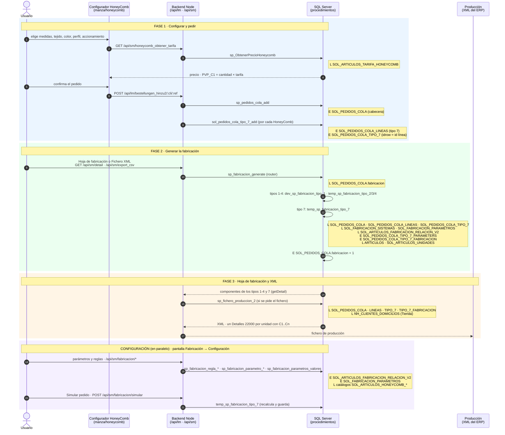
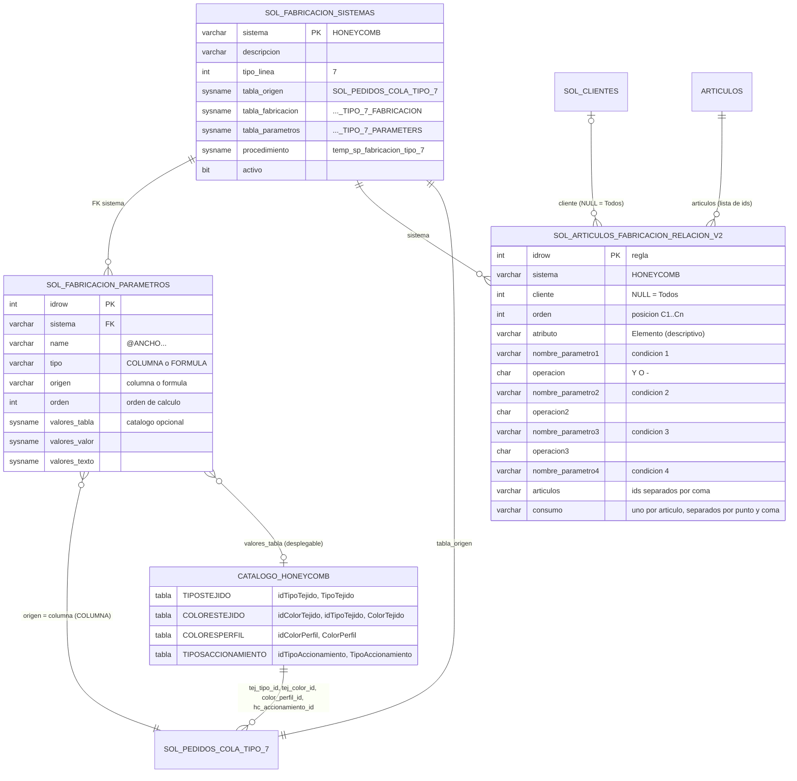
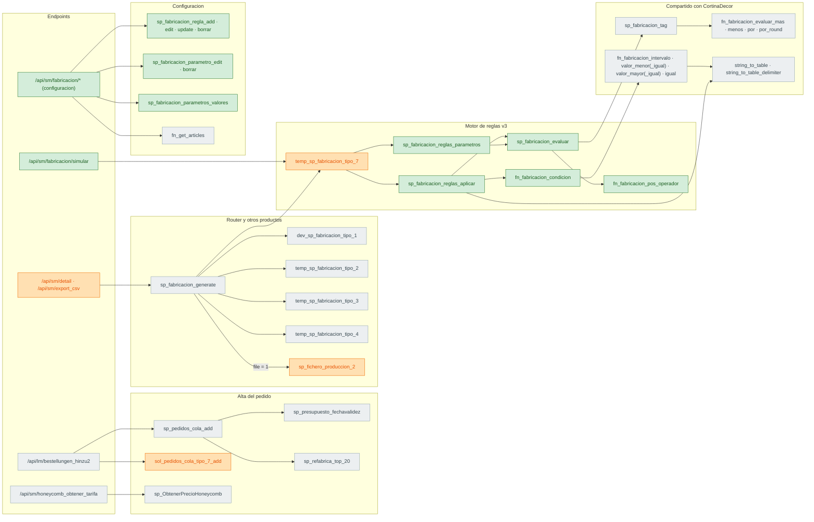
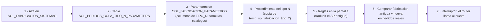

# Diagramas de la fabricación por reglas (motor v3)

Registro gráfico de la nueva forma de fabricar, con la HoneyComb (tipo 7) como primer producto.
Sirve como **plantilla para llevar el resto de productos al motor**.

> Complementa a `flujoHC.md` (explicación en texto), `REGISTRO_CAMBIOS.md` (despliegue) y
> `GUIA_CONFIGURACION_FABRICACION.md` (uso de la pantalla). Estado verificado en `SOLARMANES_DEV`,
> 2026-10-05.
>
> Los diagramas son **Mermaid**: se ven dibujados en GitHub y en VS Code (vista previa de Markdown,
> con la extensión *Markdown Preview Mermaid Support* si no salen).

**Leyenda de colores** (diagramas 3 y 4):

| Color | Significado |
|---|---|
| 🟩 verde | **Nuevo** (creado para el motor v3) |
| 🟧 naranja | **Modificado** |
| ⬜ gris | **Existente**, sin cambios |

---

## 1. Flujo de un pedido HoneyComb, de principio a fin

Quién llama a quién y qué tablas lee (**L**) o escribe (**E**) en cada momento.

---

## 2. Modelo de datos: tablas y cómo se unen

Las relaciones marcadas **FK** son claves foráneas reales en la base de datos. Las demás son
**uniones lógicas**: las hacen los procedimientos por columna, sin restricción en la tabla.

### 2.1 Pedido y resultado de la fabricación

```mermaid
erDiagram
    SOL_PEDIDOS_COLA ||--o{ SOL_PEDIDOS_COLA_LINEAS : "FK idrow = IDROW"
    SOL_PEDIDOS_COLA_LINEAS ||--o| SOL_PEDIDOS_COLA_TIPO_7 : "idrow = ID de la linea (tipo 7)"
    SOL_PEDIDOS_COLA_TIPO_7 ||--o{ SOL_PEDIDOS_COLA_TIPO_7_PARAMETERS : "idrow = id"
    SOL_PEDIDOS_COLA_TIPO_7 ||--o{ SOL_PEDIDOS_COLA_TIPO_7_FABRICACION : "idrow = id"
    ARTICULOS ||--o{ SOL_PEDIDOS_COLA_TIPO_7_FABRICACION : "articulo = IDROW"
    SOL_ARTICULOS_UNIDADES ||--o{ SOL_PEDIDOS_COLA_TIPO_7_FABRICACION : "unidad = unidad"
    NH_CLIENTES_DOMICILIOS ||--o{ SOL_PEDIDOS_COLA : "FK CLIENTE_ENTREGA = IDROW"
    SOL_CLIENTES ||--o{ SOL_PEDIDOS_COLA : "CLIENTE = idrow"

    SOL_PEDIDOS_COLA {
        int IDROW PK "id del pedido"
        int CLIENTE "decide que reglas se usan"
        int CLIENTE_ENTREGA FK "tienda para el XML"
        varchar REFCLIENTE "referencia del cliente"
        datetime FECHA
        int FABRICACION "contador de generacion (router)"
    }
    SOL_PEDIDOS_COLA_LINEAS {
        int ID PK "id de linea"
        int IDROW FK "pedido"
        int TIPO "7 = HoneyComb"
        int ARTICULO "7 = bloque XML HoneyComb"
        int LINE "70"
        decimal ANCHO
        decimal ALTO
        int CANTIDAD
    }
    SOL_PEDIDOS_COLA_TIPO_7 {
        int id PK
        int idrow "id de la linea"
        int ancho
        int alto
        int cantidad
        int tej_tipo_id
        nvarchar tej_tipo_text
        int tej_color_id
        nvarchar tej_color_text
        int color_perfil_id
        nvarchar color_perfil_text
        int hc_accionamiento_id
        nvarchar hc_accionamiento_text
        decimal T7_PVP
        varchar T7_PVP_C1 "precio del XML"
    }
    SOL_PEDIDOS_COLA_TIPO_7_PARAMETERS {
        int id PK
        int idrow "TIPO_7.id"
        int idpedido "Pos de la linea"
        varchar parametro "@ANCHO..."
        varchar valor "valor calculado"
    }
    SOL_PEDIDOS_COLA_TIPO_7_FABRICACION {
        int id
        int idrow "TIPO_7.id"
        int idpedido "Pos de la linea"
        int articulo "ARTICULOS.IDROW"
        int orden "posicion C1..Cn"
        decimal consumo "en la unidad del articulo"
        int unidad
        int cantidad
        varchar descripcion
        varchar cod_sol "va al XML"
        varchar fam_sol
        varchar seccion
    }
    ARTICULOS {
        int IDROW PK
        varchar COD_SOLUPYME
        varchar FAM_SOLUPYME
        int UNIDAD1 "3 = metros"
        varchar DESCRIPCION
        decimal PRECIO_COSTE
    }
    SOL_ARTICULOS_UNIDADES {
        int unidad PK
        varchar descripcion "Ud, ml..."
    }
    NH_CLIENTES_DOMICILIOS {
        int IDROW PK
        varchar CODSOLUPYME "Tienda"
    }
    SOL_CLIENTES {
        int idrow PK
        varchar descripcion
    }
```

### 2.2 Configuración del motor y catálogos

`CATALOGO_HONEYCOMB` agrupa las cuatro tablas `SOL_ARTICULOS_HONEYCOMB_*` del configurador.
`SOL_ARTICULOS_FABRICACION_RELACION_V2` contiene también las reglas `ENROLLABLE` del modelo SM
antiguo, que quedan fuera del motor por no estar en `SOL_FABRICACION_SISTEMAS`.

---

## 3. Mapa de procedimientos y funciones

Quién llama a quién, desde los endpoints hasta las funciones.

| Objeto | Estado | Papel |
|---|---|---|
| `sp_fabricacion_generate` | existente | Router: genera todos los tipos del pedido y, si se pide, el XML. |
| `dev_sp_fabricacion_tipo_1`, `temp_sp_fabricacion_tipo_2/3/4` | existentes | Fabricación programada a mano de los tipos 1-4 (candidatos a migrar). |
| `temp_sp_fabricacion_tipo_7` | **modificado** (reescrito) | Envoltorio del motor para el tipo 7. |
| `sol_pedidos_cola_tipo_7_add` | **modificado** | Alta de la HoneyComb con su línea, como los demás tipos. |
| `sp_fichero_produccion_2` | **modificado** | XML: bloque `articulo = 7` → `22000`. |
| `sp_fabricacion_reglas_parametros` | **nuevo** | Parámetros de una línea (columnas y fórmulas). |
| `sp_fabricacion_reglas_aplicar` | **nuevo** | Reglas del sistema y cliente → componentes. |
| `fn_fabricacion_condicion` | **nuevo** | Evalúa una condición. |
| `sp_fabricacion_evaluar` | **nuevo** | Evalúa consumos y fórmulas, incluidas las cadenas de operaciones. |
| `fn_fabricacion_pos_operador` | **nuevo** | Localiza operadores para trocear las cadenas. |
| `sp_fabricacion_regla_*`, `sp_fabricacion_parametro_*`, `sp_fabricacion_parametros_valores` | **nuevos** | Configuración desde la pantalla. |
| `sp_fabricacion_tag`, `fn_fabricacion_*`, `string_to_table*` | existentes | Piezas de CortinaDecor reutilizadas, sin cambios. |

---

## 4. Dentro del motor: `temp_sp_fabricacion_tipo_7`

Orden exacto de ejecución para un pedido.

```mermaid
flowchart TD
    A(["temp_sp_fabricacion_tipo_7 @idPedido, @print, @real"]) --> B{"@real = 1 ?"}
    B -- no --> Z0(["fin · sin tablas temp_ de tipo 7"])
    B -- si --> C["Cliente del pedido<br/>L SOL_PEDIDOS_COLA.cliente"]
    C --> D["Lineas tipo 7 con su posicion Pos<br/>L SOL_PEDIDOS_COLA_LINEAS"]
    D --> E{"¿quedan lineas?"}
    E -- no --> Z(["fin"])
    E -- si --> F["Datos de la linea<br/>L SOL_PEDIDOS_COLA_TIPO_7 (idrow = id linea)"]
    F --> G["Borra lo anterior de esa linea<br/>E TIPO_7_FABRICACION · TIPO_7_PARAMETERS"]

    G --> H["sp_fabricacion_reglas_parametros 'HONEYCOMB', id"]
    subgraph PAR["Parametros"]
        H --> H1["L SOL_FABRICACION_SISTEMAS → tabla_origen"]
        H1 --> H2["Fila del pedido como XML (FOR XML RAW)"]
        H2 --> H3["Recorre SOL_FABRICACION_PARAMETROS por orden"]
        H3 --> H4{"tipo"}
        H4 -- COLUMNA --> H5["valor de la columna (MAYUSCULAS)"]
        H4 -- FORMULA --> H6["sp_fabricacion_evaluar con los anteriores"]
    end
    H5 & H6 --> I["Guarda parametros<br/>E SOL_PEDIDOS_COLA_TIPO_7_PARAMETERS"]

    I --> J["sp_fabricacion_reglas_aplicar 'HONEYCOMB', cliente, parametros"]
    subgraph REG["Reglas"]
        J --> J1{"¿el cliente tiene reglas propias en el sistema?"}
        J1 -- si --> J2["solo sus reglas"]
        J1 -- no --> J3["reglas de Todos (cliente NULL)"]
        J2 & J3 --> J4["Por cada regla, por orden:<br/>condiciones 1-4 con fn_fabricacion_condicion<br/>encadenadas de izquierda a derecha (O = OR, Y/- = AND)"]
        J4 --> J5{"¿se cumple? (sin condiciones = siempre)"}
        J5 -- no --> J4
        J5 -- si --> J6["Por cada articulo: consumo con sp_fabricacion_evaluar<br/>(uno por articulo con punto y coma, uno solo vale para todos, vacio = 1)"]
    end
    J6 --> K["Inserta componentes<br/>E SOL_PEDIDOS_COLA_TIPO_7_FABRICACION"]
    K --> L["Enriquece desde ARTICULOS y SOL_ARTICULOS_UNIDADES<br/>unidad · precio · descripcion · cod_sol · fam_sol · seccion<br/>unidad 3 (metros): consumo / 100"]
    L --> E

    classDef nuevo fill:#d4edda,stroke:#2e7d32,color:#1b5e20
    class H,J nuevo
```

**Cómo se evalúan las expresiones** (`sp_fabricacion_evaluar`):

| Expresión | Ejemplo | Cálculo |
|---|---|---|
| Número | `2` | 2 |
| Parámetro | `@ANCHO` | su valor |
| Una operación | `@ANCHO -- 1.5` | `sp_fabricacion_tag` (como CortinaDecor) |
| Tres términos | `0.01 ** @ALTO ** 2` | `sp_fabricacion_tag` |
| Cadena | `@ANCHO -- 1.5 ** 2 ++ 10` | de izquierda a derecha: ((ancho − 1,5) × 2) + 10 |
| `*R` | `@ANCHO *R 0.02` | multiplica y redondea hacia arriba |
| Error (parámetro o número inválido) | `@X ++ 1` | −1 |

---

## 5. Plantilla para pasar otro producto al motor

Lo que se hizo para la HoneyComb y lo que habría que hacer para un tipo N (por ejemplo, tipo 4,
Compac/SolarMini).

| Paso | HoneyComb (hecho) | Tipo N (por hacer) |
|---|---|---|
| 1. Sistema | `HONEYCOMB` · tipo 7 · `SOL_PEDIDOS_COLA_TIPO_7` · `temp_sp_fabricacion_tipo_7` | `SISTEMA_N` · tipo N · `SOL_PEDIDOS_COLA_TIPO_N` · procedimiento nuevo |
| 2. Tabla de parámetros calculados | `SOL_PEDIDOS_COLA_TIPO_7_PARAMETERS` | `SOL_PEDIDOS_COLA_TIPO_N_PARAMETERS` (misma estructura) |
| 3. Parámetros | 11 columnas + catálogos de tejido, perfil y accionamiento | Columnas de `TIPO_N` (49 a 74 según el tipo) y sus catálogos |
| 4. Procedimiento | `temp_sp_fabricacion_tipo_7` | Copia cambiando sistema y tablas; el motor (`reglas_parametros`, `reglas_aplicar`) no cambia |
| 5. Reglas | Configuradas por vosotros (37 en DEV) | Traducir la lógica de `dev_sp_fabricacion_tipo_1` / `temp_sp_fabricacion_tipo_2/3/4` |
| 6. Validación | Regresión de fabricación y XML en pedidos de muestra | Comparar antiguo y nuevo en cientos de pedidos |
| 7. Activación | El router ya llamaba al tipo 7 | Un interruptor por producto para volver atrás si hace falta |

**Requisitos de estructura** (los tipos 1-4 ya los cumplen):
- `SOL_PEDIDOS_COLA_TIPO_N.idrow` apunta a `SOL_PEDIDOS_COLA_LINEAS.ID`, y `TIPO_N` tiene columna `id`.
- `…_TIPO_N_FABRICACION.idrow` y `…_TIPO_N_PARAMETERS.idrow` apuntan a `TIPO_N.id`.
- Con esto, la pantalla (incluida la simulación) y el XML funcionan sin cambios.

**Mejoras del motor que probablemente harán falta** para otros productos (ver `flujoHC.md` §10):
- Fórmulas que operen dos parámetros entre sí, por ejemplo m² = ancho × alto.
- Parámetros que busquen datos en otras tablas, por ejemplo la densidad del tejido o el artículo según tejido y color.

---

## 6. Registro de versiones de este documento

| Fecha | Cambio |
|---|---|
| 2026-10-05 | Versión inicial: flujo del pedido, modelo de datos, mapa de procedimientos, motor y plantilla. |
