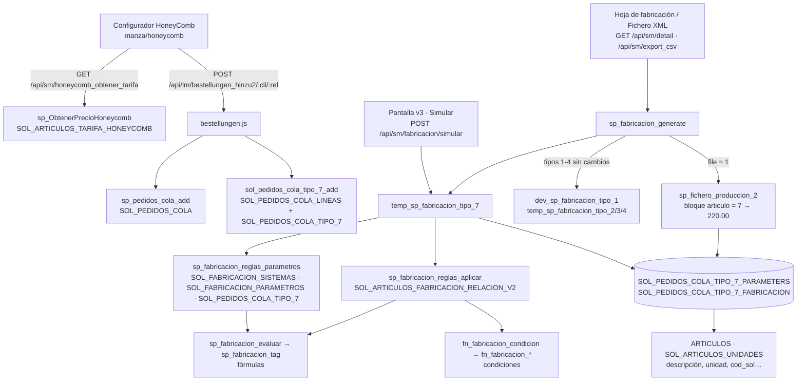

# Flujo de fabricación de una HoneyComb (tipo 7)

Documento de referencia del recorrido completo de una HoneyComb: desde que se configura en el
configurador hasta que sale en el XML de producción. Incluye todas las tablas, procedimientos,
funciones y endpoints que intervienen, y el registro de cambios hechos en la base de datos.

> Estado verificado en `SOLARMANES_DEV` el 2026-09-30. Scripts en `sqlHoney/` (01 a 06).
> Para configurar reglas, ver `GUIA_CONFIGURACION_FABRICACION.md`; para desplegar, `REGISTRO_CAMBIOS.md`;
> diagramas (flujo, modelo de datos, procedimientos y plantilla para otros productos), `diagramaFabricacionV3.md`.

---

## 1. Resumen

```
Configurador HoneyComb ──► Alta del pedido ──► Generación de fabricación ──► Hoja de fabricación / XML
 (precio por tarifa)       (cabecera, línea     (motor de reglas v3:           (220.00 + componentes
                            y datos tipo 7)      parámetros → reglas →          C1..Cn por unidad)
                                                 componentes)
                    Pantalla artikeln_fab_cd_v3: configura parámetros y reglas, y simula
```

La fabricación de una HoneyComb es la **lista de componentes** (artículo + consumo) que la
componen. No está escrita en código: la calcula un **motor de reglas** a partir de los datos del
pedido y de las reglas que se configuran en la pantalla **Fabricación → Configuración**
(`/routes/herstellen/artikeln_fab_cd_v3`).

---

## 2. Diagrama del flujo



---

## 3. Recorrido paso a paso

### Paso 1 · Configurador y precio

- **Pantalla:** `frontend/src/app/manza/honeycomb/honeycomb.component.ts`.
- **Qué elige el usuario:** ancho, alto, cantidad, tipo y color de tejido, color de perfil y tipo de accionamiento. Los catálogos se leen de las tablas `SOL_ARTICULOS_HONEYCOMB_*`: tipos de tejido, colores, colores de perfil y accionamientos.
- **Precio:** `GET /api/sm/honeycomb_obtener_tarifa?ancho&alto&cantidad&tipoTejido` (`backend/controllers/sm/honeycomb.js`). El endpoint llama a `sp_ObtenerPrecioHoneycomb`, que busca el precio en la matriz `SOL_ARTICULOS_TARIFA_HONEYCOMB` por ancho y alto, y calcula:
  - `PVP_C1 = cantidad × precio de tarifa`
  - `PVP = PVP_C1 × 1,9`
- **Línea de la cesta:** `CortinaTipo.HoneyComb_Add(...)` crea la línea con `TipoCortina = 7`, los datos elegidos y los precios `T7_PVP`, `T7_PVP_C1`, `T7_Fecha_Entrega` y `T7_Transporte`.

### Paso 2 · Alta del pedido

`POST /api/lm/bestellungen_hinzu2/:cli/:ref` (`backend/controllers/sm/lm/bestellungen.js`).

1. **`sp_pedidos_cola_add`** crea la cabecera en `SOL_PEDIDOS_COLA` con cliente, fecha, referencia GUID y `refcliente = :ref`, y devuelve el id del pedido. Todavía no genera la fabricación (esa llamada está comentada en el SP).
2. **Líneas:** para cada línea de la cesta con `TipoCortina == 7`, `Add_Tipo_7(idPedido, línea)` ejecuta **`sol_pedidos_cola_tipo_7_add`** (modificado), que:
   - Inserta la línea en `SOL_PEDIDOS_COLA_LINEAS` (`idrow` = pedido, `line` = 70, `articulo` = 7, `tipo` = 7, ancho, alto, cantidad).
   - Inserta los datos HoneyComb en `SOL_PEDIDOS_COLA_TIPO_7`, con `idrow` = **id de la línea** (antes era el id del pedido).

### Paso 3 · Generación de la fabricación

Se dispara desde tres sitios:

| Origen | Endpoint | Qué hace |
|---|---|---|
| Hoja de fabricación | `GET /api/sm/detail/:id/:cli/:force` | `sp_fabricacion_generate` (genera si no estaba generada o si `force = 1`) y devuelve los componentes de todos los tipos |
| Fichero de producción | `GET /api/sm/export_csv/:id/:cli` | `sp_fabricacion_generate` con `@file = 1` → devuelve el XML |
| Pantalla v3 · Simular | `POST /api/sm/fabricacion/simular` | Ejecuta **solo** `temp_sp_fabricacion_tipo_7` y **siempre** recalcula (y guarda) |

**`sp_fabricacion_generate(@idPedido, @cliente = 1, @file = 0, @force = 0)`** (router, sin cambios):
- Si `SOL_PEDIDOS_COLA.fabricacion` es 0 o `@force = 1`, ejecuta en este orden `dev_sp_fabricacion_tipo_1`, `temp_sp_fabricacion_tipo_2`, `…_3`, `…_4` y **`temp_sp_fabricacion_tipo_7`**, todos con `(@idPedido, 0, 1)`. Después incrementa `SOL_PEDIDOS_COLA.fabricacion`.
- Si `@file = 1`, ejecuta `sp_fichero_produccion_2` (paso 5).

### Paso 4 · Motor de reglas: `temp_sp_fabricacion_tipo_7(@idPedido, @print, @real)`

Con `@real <> 1` no hace nada: no existen tablas `temp_` de tipo 7 para presupuestos. Con `@real = 1`:

1. **Cliente del pedido:** lo lee de `SOL_PEDIDOS_COLA.cliente`.
2. **Líneas:** toma las de `SOL_PEDIDOS_COLA_LINEAS` del pedido, numeradas por `id` (esa posición es el "Pos"), y se queda con las de `tipo = 7`.
3. **Para cada línea HoneyComb:**
   1. Busca su fila en `SOL_PEDIDOS_COLA_TIPO_7` (`idrow` = id de línea) y lee id, cantidad, ancho y alto.
   2. **Borra** su fabricación y sus parámetros anteriores (solo de esa línea tipo 7).
   3. **Parámetros:** `sp_fabricacion_reglas_parametros('HONEYCOMB', id)` devuelve cada parámetro con su valor (ver §6.2). Se guardan en `SOL_PEDIDOS_COLA_TIPO_7_PARAMETERS`.
   4. **Reglas:** `sp_fabricacion_reglas_aplicar('HONEYCOMB', cliente, parámetros)` devuelve los componentes (orden, artículo, consumo, regla).
   5. **Inserta** los componentes en `SOL_PEDIDOS_COLA_TIPO_7_FABRICACION`, ordenados por `orden` y regla.
   6. **Enriquece** desde `ARTICULOS` y `SOL_ARTICULOS_UNIDADES`:
      - Toma unidad, precio de coste, descripción, unidad (texto), `cod_sol`, `fam_sol` y sección.
      - En unidad 3 (metros), el consumo se divide entre 100, porque en las reglas se escribe en cm.

### Paso 5 · Hoja de fabricación y XML

- **Hoja de fabricación:** `getDetail` y `getDetail_ID` (`backend/controllers/sm/export.js`, **modificados**) unen `SOL_PEDIDOS_COLA_TIPO_7_FABRICACION` a los componentes de los tipos 1-4.
- **XML:** `sp_fichero_produccion_2` (**modificado**, bloque nuevo `if @articulo = 7`). Por cada línea HoneyComb y por **cada unidad** (1..cantidad) genera:

```xml
<Detalles>
  <Articulo>220.00</Articulo>
  <Descripcion>LEROY MERLIN | HONEYCOMB</Descripcion>   <!-- LEROY MERLIN si cliente 1 o 5 -->
  <DescCliente>refcliente</DescCliente>
  <Unidades>1</Unidades>
  <Ancho>1,200000</Ancho><Alto>1,500000</Alto>           <!-- en metros -->
  <Precio>363,34</Precio>                                <!-- T7_PVP_C1 (o T7_PVP) -->
  <Tienda>…</Tienda>                                     <!-- NH_CLIENTES_DOMICILIOS.CODSOLUPYME -->
  <C1>04691</C1><C1_CANT>1</C1_CANT><C1_P1>ancho m</C1_P1><C1_P2>alto m</C1_P2>
  <C1_P3>0</C1_P3><C1_FACTOR>consumo</C1_FACTOR><C1_SECCION>…</C1_SECCION>
  <C2>…</C2> …                                           <!-- un Cn por componente, por orden -->
</Detalles>
```

La cabecera `<Cabecera>` (cliente 002000 para Leroy, fecha y referencia) es la que ya existía.

---

## 4. Ejemplo real: pedido 17076

Pedido de prueba en DEV (`PRUEBA-HC-CLAUDE`), cliente **1 · Leroy Merlin**, una HoneyComb:

| Dato | Valor |
|---|---|
| `SOL_PEDIDOS_COLA.idrow` | 17076 |
| Línea (`SOL_PEDIDOS_COLA_LINEAS.id`) | 27900 · tipo 7 · articulo 7 · Pos 1 |
| `SOL_PEDIDOS_COLA_TIPO_7.id` | 6 (`idrow` = 27900) |
| Medidas / cantidad | 120 × 150 cm · 2 uds |
| Tejido / perfil / accionamiento | OPACO BEIGE · BLANCO RAL 9016 (id 1) · CON VARILLA (id 2) |
| Precio | `T7_PVP_C1` = 363,34 |

**Parámetros calculados** (`SOL_PEDIDOS_COLA_TIPO_7_PARAMETERS`): `@CANTIDAD=2`, `@ANCHO=120`,
`@ALTO=150`, `@TEJIDO_TIPO=OPACO`, `@COLOR_PERFIL_ID=1`, `@COLOR_PERFIL=BLANCO RAL 9016`,
`@ACCIONAMIENTO_ID=2`…

**Reglas aplicadas:** Leroy Merlin no tiene reglas propias, así que se usan las de *Todos*.

| Regla | Condiciones | Artículo | Consumo regla | Resultado |
|---|---|---|---|---|
| 31 · orden 10 | `0.0 <= @ANCHO <= 600` Y `@COLOR_PERFIL == BLANCO RAL 9016` | 16468 perfil a cristal blanco | `@ANCHO--1` | 119 cm → **1,19 ml** |
| 32 · orden 20 | ídem | 16468 | `@ANCHO--1` | **1,19 ml** |
| 33 · orden 30 | ídem | 16495 tapa dcha | `1` | **1 Ud** |
| 34 · orden 40 | ídem | 16499 tapa izq | `1` | **1 Ud** |

**XML:** 2 bloques `<Detalles>` (uno por unidad), cada uno con C1..C4 (04691, 04691, 04718, 04722).

---

## 5. Tablas

### 5.1 Tablas nuevas

| Tabla | Qué guarda |
|---|---|
| **`SOL_FABRICACION_SISTEMAS`** | Catálogo de sistemas que usan el motor de reglas. Una fila por sistema. Hoy solo `HONEYCOMB`. Columnas: `sistema` (PK), `descripcion`, `tipo_linea` (7), `tabla_origen` (`SOL_PEDIDOS_COLA_TIPO_7`: de dónde se leen los datos del pedido), `tabla_fabricacion` y `tabla_parametros` (dónde se escribe el resultado), `procedimiento` (`temp_sp_fabricacion_tipo_7`: el que genera la fabricación), `activo`. La pantalla solo deja editar reglas y parámetros de sistemas **activos** de este catálogo. |
| **`SOL_FABRICACION_PARAMETROS`** | Parámetros de cada sistema: las variables que usan las reglas. Columnas: `sistema`, `name` (`@ANCHO`…), `tipo` (`COLUMNA` = columna de la `tabla_origen`; `FORMULA` = cálculo sobre parámetros anteriores), `origen` (nombre de la columna o la fórmula), `orden` (orden de cálculo), y opcionalmente `valores_tabla`, `valores_valor`, `valores_texto`: el catálogo del que salen sus valores posibles (p. ej. `@COLOR_PERFIL_ID` → `SOL_ARTICULOS_HONEYCOMB_COLORESPERFIL`, `idColorPerfil`, `ColorPerfil`), que la pantalla ofrece como desplegable en las condiciones "igual a". Único por (`sistema`, `name`). HoneyComb trae 11 de serie: cantidad, ancho, alto y tejido, color de perfil y accionamiento, cada uno como id y como texto. |
| **`SOL_PEDIDOS_COLA_TIPO_7_PARAMETERS`** | Valores de los parámetros calculados para cada línea HoneyComb en la última generación. Columnas: `idrow` (→ `SOL_PEDIDOS_COLA_TIPO_7.id`), `idpedido` (Pos de la línea), `parametro`, `valor`. Sirve para revisar por qué una regla se cumple o no; es lo que muestra Simulación a la izquierda. Equivale a `SOL_CORTINADECOR_LINES_PARAMETERS` de CortinaDecor. |

### 5.2 Tablas existentes que cambian

| Tabla | Cambio |
|---|---|
| **`SOL_ARTICULOS_FABRICACION_RELACION_V2`** | Tabla de **reglas**. Se añade la columna **`cliente`** (`int`, NULL = Todos). Las reglas del motor usan `sistema` (`HONEYCOMB`), `cliente`, `orden`, `atributo` (Elemento, descriptivo), `articulos` (ids separados por coma), `nombre_parametro1..4` (condiciones), `operacion/2/3` (Y, O, -) y `consumo` (uno por artículo, separados por `;`). `valor` se guarda vacío. En la misma tabla siguen las reglas `ENROLLABLE` del modelo SM antiguo: no están en el catálogo, así que la pantalla no las toca. |
| **`SOL_PEDIDOS_COLA_TIPO_7`** | Sin cambios de columnas. Cambia el significado de **`idrow`**: ahora es el id de la línea (`SOL_PEDIDOS_COLA_LINEAS.id`), no el del pedido. Guarda los datos HoneyComb: medidas, cantidad, tejido (id y texto), color de tejido, color de perfil, accionamiento y precios `T7_*`. |

### 5.3 Tablas existentes que usa el flujo (sin cambios)

| Tabla | Para qué la usa el flujo |
|---|---|
| `SOL_PEDIDOS_COLA` | Cabecera del pedido: `cliente` (decide qué reglas se usan), `refcliente`, `fecha`, `cliente_entrega` y `fabricacion` (contador de generación que usa el router). |
| `SOL_PEDIDOS_COLA_LINEAS` | Líneas del pedido. La HoneyComb es `tipo = 7`, `articulo = 7`, `line = 70`. Su posición en el pedido es el "Pos". |
| `SOL_PEDIDOS_COLA_TIPO_7_FABRICACION` | **Resultado:** componentes de cada línea. `idrow` → `TIPO_7.id`, `idpedido` (Pos), `articulo`, `cantidad` (de la línea), `unidad`, `orden`, `consumo` (ya en la unidad del artículo), `ancho`, `alto`, `descripcion`, `descUnidad`, `cod_sol`, `fam_sol`, `seccion`, `precio`. Existía vacía; el motor anterior no la rellenaba bien. |
| `ARTICULOS` | Maestro de artículos: `unidad1`, `precio_coste`, `descripcion`, `cod_solupyme` (→ `cod_sol`, que va al XML), `fam_solupyme`, `seccion`. |
| `SOL_ARTICULOS_UNIDADES` | Texto de cada unidad (1 = Ud, 3 = ml…) → `descUnidad`. |
| `SOL_CLIENTES` | Catálogo de clientes (1 Leroy Merlin, 4 Solarmanes, 5 Leroy Merlin Web…) para el campo Cliente de las reglas. |
| `NH_CLIENTES_DOMICILIOS` | `CODSOLUPYME` de la tienda de entrega, para `<Tienda>` en el XML. |
| `SOL_ARTICULOS_TARIFA_HONEYCOMB` | Matriz de precios por ancho × alto (configurador, paso 1). |
| `SOL_ARTICULOS_HONEYCOMB_*` | Catálogos del configurador (tipos y colores de tejido, colores de perfil, accionamientos) y `SOL_ARTICULOS_HONEYCOMB_ARTICULO`, la lista de artículos HoneyComb del ERP, útil para elegir artículos en las reglas. |

### 5.4 Tipo de tabla usado

`dbo.Parameters3Type` (existente): tabla de (`name`, `type`, `value`) de 255 caracteres. Es la lista de
parámetros que se pasa a las funciones de condición y consumo. Es el mismo tipo que usa CortinaDecor.

---

## 6. Procedimientos y funciones

### 6.1 Flujo de pedido

| Objeto | Estado | Qué hace |
|---|---|---|
| `sp_pedidos_cola_add` | existente | Crea la cabecera del pedido en `SOL_PEDIDOS_COLA` y devuelve su id. |
| `sol_pedidos_cola_tipo_7_add` | **modificado** | Alta de una HoneyComb: crea la línea tipo 7 en `SOL_PEDIDOS_COLA_LINEAS` y la fila en `SOL_PEDIDOS_COLA_TIPO_7` enlazada a esa línea. Con `@id <> 0` actualiza los datos y las medidas y cantidad de la línea. |
| `sp_fabricacion_generate` | existente | Router de la fabricación de pedidos Solarmanes/Leroy: ejecuta los procedimientos de los tipos 1, 2, 3, 4 y 7 y, si se pide, el XML. |
| `sp_fichero_produccion_2` | **modificado** | Genera el XML de producción de todas las líneas del pedido. Añade el bloque `@articulo = 7` (HoneyComb → `220.00`); el resto del procedimiento queda idéntico. |
| `sp_ObtenerPrecioHoneycomb` | existente | Precio de tarifa HoneyComb por ancho × alto (configurador). |

### 6.2 Motor de reglas (nuevos, genéricos por sistema)

| Objeto | Qué hace |
|---|---|
| **`temp_sp_fabricacion_tipo_7(@idPedido, @print, @real)`** | **Reescrito.** Genera la fabricación HoneyComb de un pedido (paso 4). Solo toca líneas y tablas del tipo 7. Sustituye a la versión anterior, que leía `sol_pedidos_cola_tipo_4` y **borraba la fabricación de Compac/SolarMini**. |
| **`sp_fabricacion_reglas_parametros(@sistema, @id)`** | Calcula los parámetros de una línea. Lee la fila `@id` de la `tabla_origen` del sistema (con `FOR XML RAW`) y recorre `SOL_FABRICACION_PARAMETROS` por `orden`: un `COLUMNA` toma el valor de la columna (en mayúsculas y sin espacios en los extremos); un `FORMULA` se calcula con `sp_fabricacion_evaluar` usando los parámetros ya calculados. Devuelve (`name`, `type`, `value`). |
| **`sp_fabricacion_reglas_aplicar(@sistema, @cliente, @parametros)`** | Aplica las reglas del sistema. Si `@cliente` tiene alguna regla propia en ese sistema, usa **solo las suyas**; si no, las de cliente NULL (Todos). Para cada regla, por `orden`: evalúa hasta 4 condiciones con `fn_fabricacion_condicion`, encadenadas de izquierda a derecha (`O` = OR; `Y` o `-` = AND; las vacías se ignoran; sin condiciones aplica siempre). Si aplica, por cada artículo calcula el consumo con `sp_fabricacion_evaluar` (lista posicional separada por `;`; uno solo vale para todos; vacío = 1). Devuelve (`orden`, `articulo`, `consumo`, `idregla`). No escribe en ninguna tabla. |
| **`fn_fabricacion_condicion(@condicion, @parametros)`** | Devuelve 1 si se cumple una condición y 0 si no. Quita los espacios y detecta el operador en el mismo orden que CortinaDecor: `a <= @P <= b` → `fn_fabricacion_intervalo`; `<=` → `fn_fabricacion_valor_menor_igual`; `<<` → `…_valor_menor`; `==` → `fn_fabricacion_igual`; `>=` → `…_valor_mayor_igual`; `>>` → `…_valor_mayor`. |
| **`fn_fabricacion_pos_operador(@texto, @desde)`** | Posición del primer operador de consumo (`++`, `--`, `**`, `*R`) a partir de `@desde`; la usa `sp_fabricacion_evaluar` para trocear cadenas. |
| **`sp_fabricacion_evaluar(@expresion, @parametros, @resultado OUT)`** | Calcula un consumo o una fórmula. Quita los espacios. Un parámetro solo (`@ANCHO`) devuelve su valor, o -1 si no es numérico. El resto lo resuelve `sp_fabricacion_tag`. Añade a `sp_fabricacion_tag` dos correcciones: el caso del parámetro solo (que allí daba -1) y las expresiones de 3 términos con espacios (que allí daban 0). Además admite **cadenas de operaciones** sobre un parámetro (`@ANCHO -- 1.5 ** 2 ++ 10`), que se calculan de izquierda a derecha en el orden escrito, sin prioridad de `**`. Una sola operación se sigue resolviendo con `sp_fabricacion_tag`, igual que antes. |

### 6.3 Funciones existentes que usa el motor (compartidas con CortinaDecor, sin cambios)

| Objeto | Qué hace |
|---|---|
| `sp_fabricacion_tag` | Evalúa un consumo según su operador: `++` → `fn_fabricacion_evaluar_mas`, `--` → `…_menos`, `**` → `…_por`, `*R` → `…_por_round` (multiplica y redondea hacia arriba). Un número se devuelve tal cual. |
| `fn_fabricacion_intervalo`, `fn_fabricacion_valor_menor(_igual)`, `fn_fabricacion_valor_mayor(_igual)`, `fn_fabricacion_igual` | Evaluación de cada tipo de condición sobre `Parameters3Type`. `fn_fabricacion_igual` compara sin espacios. |
| `fn_fabricacion_evaluar_mas / _menos / _por / _por_round` | Operaciones de consumo. |
| `string_to_table`, `string_to_table_delimiter` | Trocean listas (artículos, consumos, condiciones). |
| `fn_get_articles(@ids, ',')` | Texto "código descripción" de una lista de artículos (columna Artículos de la pantalla). |

### 6.4 Configuración (nuevos, pantalla v3)

Todos trabajan solo con sistemas **activos** de `SOL_FABRICACION_SISTEMAS`. No pueden tocar reglas
`ENROLLABLE` del modelo antiguo ni de CortinaDecor.

| Objeto | Qué hace | Devuelve |
|---|---|---|
| `sp_fabricacion_regla_add` | Crea una regla (sistema, cliente, orden, elemento, condiciones, operadores, artículos, consumo). | id nuevo · -1 sistema no válido · -2 cliente no válido |
| `sp_fabricacion_regla_edit` | Guarda una regla completa (ventana de edición). No permite cambiarla de sistema. | 1 OK · 0 no encontrada · -1 / -2 |
| `sp_fabricacion_regla_update` | Cambia un solo campo de una lista cerrada (incluido `cliente`); normaliza los operadores a Y/O/-. | 1 OK · 0 no válido |
| `sp_fabricacion_regla_borrar` | Borra una regla de un sistema del catálogo. | filas borradas |
| `sp_fabricacion_parametro_edit` | Alta o modificación de un parámetro. Valida el nombre (`@` + letras, números o `_`), el tipo, que la columna exista en la `tabla_origen` y que la fórmula no esté vacía. | 1 OK · -1 nombre · -2 tipo · -3 columna · -4 fórmula · -5 sistema |
| `sp_fabricacion_parametro_borrar` | Borra un parámetro de un sistema. | filas borradas |
| `sp_fabricacion_parametros_valores` | Valores posibles de los parámetros con catálogo (`valores_tabla/valor/texto`). Comprueba tabla y columnas en `sys.columns` antes de consultarlas. | (`name`, `valor`, `texto`) |

---

## 7. Endpoints

### 7.1 Nuevos · `backend/controllers/sm/fabricacion_reglas.js`

Todos bajo `/api/sm`, con `Auth.ensureAuth`: necesitan la cabecera `Authorization` con el token de
sesión. Rutas en `backend/routes/sm_routes.js`.

| Método y ruta | Entrada | Qué hace | Salida |
|---|---|---|---|
| `GET /fabricacion/sistemas` | — | Sistemas activos del catálogo (selector de la cabecera). | `{Table:[{sistema, descripcion}]}` |
| `GET /fabricacion/clientes` | — | Clientes de `SOL_CLIENTES` (campo Cliente de las reglas). | `{Table:[{idrow, descripcion}]}` |
| `GET /fabricacion/articulos?ids=1,2` | ids numéricos (los demás se descartan) | Código, descripción y unidad de los artículos de una regla (ventana de edición). | `{Table:[{idrow, cod_sol, descripcion, unidad, descUnidad}]}` |
| `GET /fabricacion/reglas?sistema=X` | sistema | Reglas del sistema con el nombre del cliente ("Todos" si es NULL) y el texto de los artículos. | `{Table:[regla…]}` |
| `POST /fabricacion/reglas` | regla | Alta → `sp_fabricacion_regla_add`. | `{message:'OK', idrow}` / 400 con motivo |
| `POST /fabricacion/reglas/save` | regla con `idrow` | Guardado completo desde la ventana → `sp_fabricacion_regla_edit`; con `idrow` 0 crea la regla. | `{message:'OK', idrow}` / 400 / 404 |
| `POST /fabricacion/reglas/update` | `{idrow, campo, valor}` | Cambio de un campo → `sp_fabricacion_regla_update`. | `{message:'OK'}` / 400 |
| `POST /fabricacion/reglas/delete` | `{idrow}` | Borrado → `sp_fabricacion_regla_borrar`. | `{message:'OK'}` / 404 |
| `GET /fabricacion/parametros?sistema=X` | sistema | Parámetros del sistema por orden. | `{Table:[{idrow, name, tipo, origen, orden}]}` |
| `GET /fabricacion/parametros/valores?sistema=X` | sistema | Valores posibles de los parámetros con catálogo (desplegable de las condiciones) → `sp_fabricacion_parametros_valores`. | `{Table:[{name, valor, texto}]}` |
| `GET /fabricacion/columnas?sistema=X` | sistema | Columnas de la `tabla_origen` (para parámetros de tipo Dato del pedido). | `{Table:[{name}]}` |
| `POST /fabricacion/parametros` | `{sistema, name, tipo, origen, orden}` | Alta o modificación → `sp_fabricacion_parametro_edit`. | `{message:'OK'}` / 400 con motivo |
| `POST /fabricacion/parametros/delete` | `{sistema, name}` | Borrado → `sp_fabricacion_parametro_borrar`. | `{message:'OK'}` / 404 |
| `POST /fabricacion/simular` | `{idPedido, sistema}` | Ejecuta el `procedimiento` del sistema para el pedido (**recalcula y guarda**) y devuelve componentes, parámetros y qué reglas se usaron. | `{Fabricacion:[…], Parametros:[…], Pedido:{cliente, cliente_nombre, reglas_cliente}}` |

Los nombres de tablas y procedimientos que usa `simular` salen del catálogo y se validan
(`[A-Za-z0-9_]`) antes de usarse en SQL. Todos los demás valores van como parámetros.

### 7.2 Existentes modificados

| Endpoint | Cambio |
|---|---|
| `GET /api/sm/detail/:id/:cli/:force` (`getDetail`) | Incluye los componentes de `SOL_PEDIDOS_COLA_TIPO_7_FABRICACION`. |
| `getDetail_ID` (`/api/sm/detail_id/...`) | Ídem para una línea. |

### 7.3 Existentes que intervienen (sin cambios)

| Endpoint | Papel |
|---|---|
| `GET /api/sm/honeycomb_obtener_tarifa` | Precio en el configurador. |
| `POST /api/lm/bestellungen_hinzu2/:cli/:ref` | Alta del pedido (ya gestionaba el tipo 7). |
| `GET /api/sm/export_csv/:id/:cli` | Fichero XML de producción. |

---

## 8. Registro de cambios en la base de datos

Scripts idempotentes en `sqlHoney/`, en este orden. Llevan `SET QUOTED_IDENTIFIER ON`, que es
obligatorio porque el motor usa métodos XML. Copias de lo anterior en `sqlHoney/backup/`.

| Script | Cambios |
|---|---|
| `01_tablas_motor_fabricacion.sql` | **Crea** `SOL_FABRICACION_SISTEMAS` (con la fila `HONEYCOMB`), `SOL_FABRICACION_PARAMETROS` (con los 11 parámetros base HoneyComb) y `SOL_PEDIDOS_COLA_TIPO_7_PARAMETERS`. **Añade** la columna `cliente` a `SOL_ARTICULOS_FABRICACION_RELACION_V2`. Si existe `SOL_ARTICULOS_HONEYCOMB_FABRICACION_PARAMETROS` (primera versión, solo DEV), migra sus filas y la elimina. |
| `02_sol_pedidos_cola_tipo_7_add.sql` | **Modifica** `sol_pedidos_cola_tipo_7_add`: crea la línea tipo 7 y enlaza `TIPO_7.idrow` a la línea. |
| `03_migracion_lineas_tipo_7.sql` | **Datos:** para cada fila antigua de `SOL_PEDIDOS_COLA_TIPO_7` (`idrow` = pedido) crea su línea tipo 7 y repunta `idrow`. En DEV se migraron 2 filas (pedidos 16866 y 16950). |
| `04_temp_sp_fabricacion_tipo_7.sql` | **Crea** `fn_fabricacion_condicion`, `sp_fabricacion_evaluar`, `sp_fabricacion_reglas_parametros` y `sp_fabricacion_reglas_aplicar`. **Reescribe** `temp_sp_fabricacion_tipo_7`. |
| `05_sps_configuracion_fabricacion.sql` | **Crea** `sp_fabricacion_regla_add/_edit/_update/_borrar` y `sp_fabricacion_parametro_edit/_borrar`. **Elimina**, si existen, los `sp_honeycomb_fabricacion_*` de la primera versión. |
| `06_sp_fichero_produccion_2.sql` | **Modifica** `sp_fichero_produccion_2`: añade el bloque HoneyComb (`220.00`). La versión de partida es idéntica en DEV, TEST y PROD. |

**Otros cambios hechos en DEV durante el desarrollo** (no hay que llevarlos a PROD):
- `sp_honeycomb_fabricacion_*`: primera versión, sustituida por los `sp_fabricacion_*`.
- `sp_fabricacion_reglas_probar` y el parámetro `@valores` de `sp_fabricacion_reglas_parametros`: la prueba sin pedido se descartó y se eliminó.
- Pedido de prueba **17076** (`PRUEBA-HC-CLAUDE`), creado por el alta normal de pedidos.

**Datos de configuración:** las reglas y los parámetros son **datos**. Lo configurado en DEV no pasa
solo a producción (ver `REGISTRO_CAMBIOS.md`, checklist de paso a producción).

---

## 9. Pantalla de configuración (artikeln_fab_cd_v3)

`frontend/src/app/routes/herstellen/artikeln-fac-cd-v3/` · menú **Fabricación → Configuración** ·
permiso `fab_config`.

| Parte | Qué hace | Endpoints |
|---|---|---|
| Cabecera · Sistema | Elige el sistema (hoy HoneyComb); las tres pestañas trabajan sobre él. | `/fabricacion/sistemas` |
| Pestaña Parámetros | Alta, edición y borrado de parámetros (Dato del pedido o Fórmula). | `/fabricacion/parametros`, `/fabricacion/columnas` |
| Pestaña Reglas | Tabla con estado de validación (✔/⚠), acciones (editar, duplicar, borrar), columnas ocultables (solo en pantalla, se recuerda por navegador) y ajuste de columnas al contenido. La ventana de edición tiene condiciones y consumos en desplegables, resumen en texto y validación antes de guardar. | `/fabricacion/reglas`, `/reglas/save`, `/reglas/delete`, `/fabricacion/clientes`, `/fabricacion/articulos` |
| Pestaña Simulación | Recalcula y guarda la fabricación de un pedido, muestra parámetros y componentes, y descarga el XML. | `/fabricacion/simular`, `/api/sm/export_csv` |

La lógica de interpretación y validación de condiciones y consumos está en
`fabricacion-reglas.util.ts`. Replica exactamente la sintaxis que acepta el motor SQL.

---

## 10. Limitaciones conocidas

- **Fórmulas y consumos:** operan un parámetro con números (admiten cadenas: `@ANCHO -- 1.5 ** 2`, de izquierda a derecha). No se puede hacer `@ANCHO ** @ALTO`, así que el consumo del tejido en m² necesitaría un parámetro calculado nuevo (`@M2`).
- **Presupuestos:** `/api/lm/budget_hinzu2` no guarda líneas tipo 7.
- **Precio con cantidad > 1:** cada `<Detalles>` lleva el total de la línea (`T7_PVP_C1`), igual que el tipo 1. Pendiente de confirmar con el ERP.
- **Datos antiguos:** el pedido 16866 tiene accionamiento id 4 ("CON MOTOR"), que no existe en el catálogo actual.
- **`sp_fabricacion_mrp_sm`** (modelo SM antiguo, que el router no usa) lee todas las reglas de `SOL_ARTICULOS_FABRICACION_RELACION_V2` sin filtrar por sistema. Si se reactiva, hay que filtrar por `sistema`.
